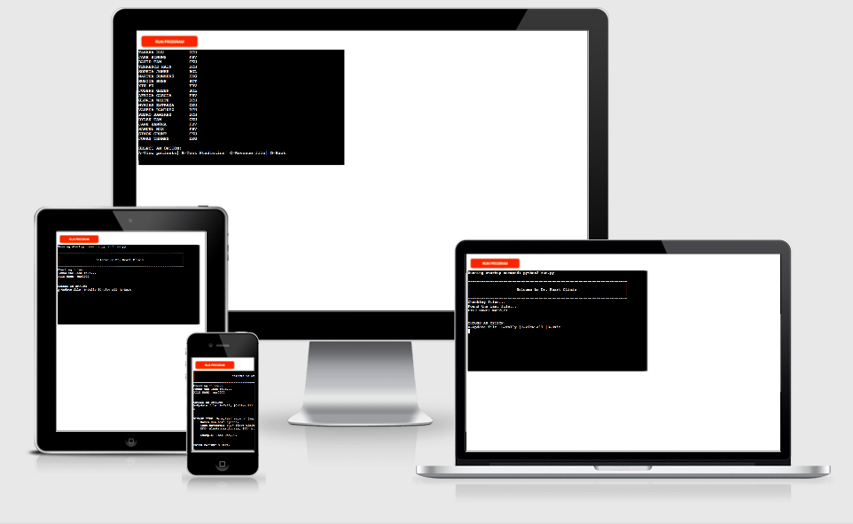
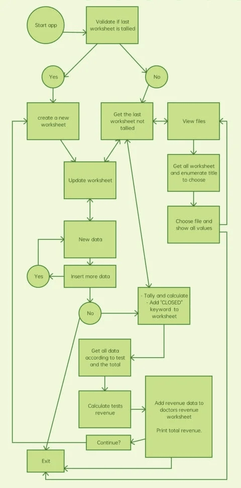
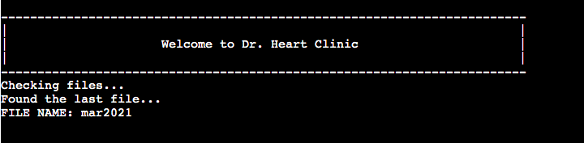
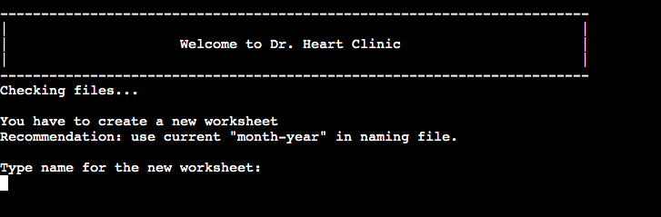
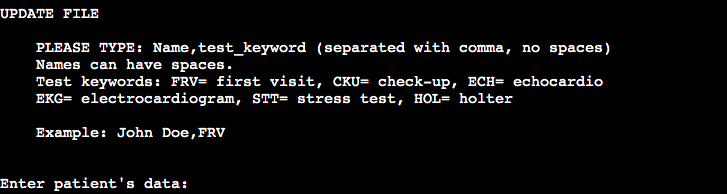

# [Dr Heart Clinic - Portfolio 3](https://portfolio-3-dr-heart-clinic.herokuapp.com/)
***
 
## Table of Contents:
* [What does it do and what does it need to fulfill?](#what-does-it-do-and-what-does-it-need-to-fulfill)
* [Functionality of Project](#functionality-of-project)
* [Wireframing](#wireframing)
* [Technology Used](#technology-used)
* [Database](#database)
* [Features](#features)
   * [Future Features](#future-features)
* [Testing](#testing)
   * [Defensive Design](#defensive-design)
* [Deployment](#deployment)
* [Credits](#credits)
   * [Special Thanks & Acknowledgements](#special-thanks--acknowledgements)
 
***
 
## Welcome to Dr. Heart Clinic!
 

***
 
## What does it do and what does it need to fulfill?
The application helps the "Dr. Heart Clinic" to control data of each patient and visualize all monthly tests statistics and tests revenue data.
 
### Functionality of Project
This application contains functions such as:
 - to gather data of each patient
 - to save data into a google spreasheet
 - to calculate total tests
 - to calculate amount value of each tests and update the clinic's monthly revenue.
 - view worksheets data
 
[Back to top](#table-of-contents)
 
## Chart
 
The flow chart

 
## Technology Used
 
#### Languages, Frameworks, Editors & Version Control:
 
* Tech stack used:

   - [Python](https://www.python.org/)

* Editor and Version Control:

   - Git for version control

   - [Gitpod](https://www.gitpod.io/) is used as the editor

   - [Github](https://github.com/) is used to store the project

   - [Heroku](https://www.heroku.com) is used to deploy the project
 
#### Tools Used:
 
* Google Drive
* Google Sheets to store all patients data and all the calculated data

[Back to Top](#table-of-contents)

## Features
 
The project boasts several key features:

* WELCOME MESSAGE AND CHECKING FILE TO UPDATE

Welcomes the user when the app starts. First it checks all files and get the last file for data update. The name of the file to be updated appears on the screen so the user knows what file is to update, which is, the current month.

* CREATE NEW WORKSHEET

If the app detects that there is no file to update when user runs the app (meaning, the last file is already calculated and tallied), it asks the user to create a new worksheet before starting to work.

* MAIN MENU

There are different options in the main menu of the app:

- Add data to update file
- Tally, calculate and update worksheets
- View worksheets data
- Exit

* ADD DATA

To enter new data into the current month worksheet:

      - The data should be separated by comma and no spaces in between.
      - Patient's name can have spaces.
      - Use only the tests keywords to update file
      - Only two data is allowed: NAME,TEST-KEYWORD
         An example is shown to guide the user.

* TALLY, CALCULATE AND UPDATE WORKSHEETS

When tally option is selected, a message is prompted to the user reminding that the worksheet will be unaccessible for new data and a new worksheet should be created.

This feature includes:

      - Appending "CLOSED" keyword into the worksheet
      as an indication that the worksheet is tallied and closed
      - Gets all the patients tests and tally them
      - Calculates the amount value of each tallied tests to get the revenue
      - Updates the worksheets to save all gathered data and the calculated revenue

* VIEW DATA FROM WORKSHEET

   * View patients

      To view all patients name and tests.

   * Test statistics
   
      To view all tests tally result.

   * Revenue File
   
      To view monthly revenue by test.

[Back to Top](#table-of-contents)
 
#### Future Features:
 
* For future features:

   * Create a patient's database
   * Search patient and view history of patient's test
   * Add date when entering new data
   * Calculate total revenue of a specific range (6 months / yearly)
 
## Testing
 
* [Pep8online](http://pep8online.com/) was used to check the Python code and to make sure there are no errors or bugs.

* Manual testing was done during the development of the project. The terminal was used for testing before pushing to the main branch to make sure there's no error in the code.

* Tested all new data are saved to the worksheet, new worksheet is accessible when app is running. Tested all the calculations are correct and each worksheet are updated with the tallied and calculated results.

* Tested the deployed project to make sure all functions are working well and no error or bugs are found.
 
### Found Bugs and Fixes:

* My initial code to go back to another menu was calling the function that called that function. My mentor helped me fix the problem since it can consume a lot of memory and it's not a good practice. I fixed the problem using while loops and the back option is done by breaking out from the loop.

* To avoid entering typos in the tests names I created keywords for each tests. The entered data is validated and if the entered test keyword is in the list of keywords, the patient name and the test keyword will be saved into the current worksheet. If keyword is not in the list, an error message is prompted for the user to reenter new data.

* I manage to create a code to keep the working cycle without rerunning the app after tallying and calculating data. I used a while loop that validates the answer (Y or N) after asking to continue working, and if the answer is in the options it breaks the loop returning the validated answer. A function is executed according to the user's answer. 'Y' means create new worksheet and to maintain inside the loop and continue working. 'N' means exiting app without creating new worksheet and it means breaking out of the loop. A new one will be created when the application is rerun.

* String formatting was a life-saver for printing data from a worksheet into the terminal. It aligns all the data for readability. Can be aligned to the left, right, or center.

* Time module is very handy too for pausing code for a few seconds so that the user doesn't get lost when a message prompts. It's also handy for showing data one at a time. Used in View patients option.
 
[Back to Top](#table-of-contents)
 
## Deployment
 
[Heroku](https://www.heroku.com) is a PaaS cloud service used to deploy python projects like this one.

#### PREREQUISITE

* List dependencies in `requirements.txt` needed in Heroku to deploy the project correctly.

   * To create the list of requirements, type in the terminal:
   `pip3 freeze > requirements.txt` and press `enter`

#### CREATE A HEROKU APP

1. Click `Create new app` from the Heroku dashboard.
2. Give the app a unique name, select region and click `Create app` button.
3. After creating the app click `Settings` from the menu bar right below the projects name.
4. Go to `Config vars` section and click `Reveal config vars`. It is where sensitive data is stored to keep it safe from public.
5. In the `Key` field, enter CREDS (all capital letters).
6. Copy the `creds.json` file from the gitpod workspace and paste it into the `Value` field. Click `Add` button.
7. Add `Key`: PORT `Value`: 8000 to improve compatibility with other Python libraries to avoid failed deployment.
8. Click `Add buildpack`, select `Python` and click `Save changes`.
9. Click `Add buildpack` again, select `node.js` and click `Save changes`. Make sure the buildpack are in the right order.
10. Go to the menu bar again (below the projects name) and click `Deploy`.
11. Select `Github` as the deployment method and click `Connect to Github` button.
12. In the Github authorization popup window login to Github using Github username and click `Authorize Heroku` button.
13. Type the repository name into the search bar and click `Search` button. Choose the repository and click `Connect` button right next to it.
14. Scroll down to select `Automatic deploys` option on every push to the chosen branch or `Manual deploy` option.
15. If `Manual deploy` is chosen, click `Deploy branch` button. Heroku will start to build the application. Python, the dependencies, node.js and all the packages to run the mock terminal will be installed.
16. When app is deployed, a `View` button appears underneath. Click button to open the deployed project.
 
[Back to Top](#table-of-contents)
 
## Credits
 
* Love Sandwich
* Geeks for geeks
   * [To convert two list into dictionary](https://www.geeksforgeeks.org/python-convert-two-lists-into-a-dictionary/)
   * [String alignment f-string](https://www.geeksforgeeks.org/string-alignment-in-python-f-string/)
* Stackoverflow
   * [To print a dictionary horizontally with alignment](https://stackoverflow.com/questions/17330139/python-printing-a-dictionary-as-a-horizontal-table-with-headers)
* This pointer
   * [Covert list of lists](https://thispointer.com/python-convert-list-of-lists-or-nested-list-to-flat-list/)
* [Derek Shidler Tutorial for Adventure game](https://www.derekshidler.com/how-to-create-a-text-based-adventure-and-quiz-game-in-python/)
* [Gspread docs.](https://docs.gspread.org/en/latest/user-guide.html) Examples of gspread usage.
 
[Back to Top](#table-of-contents)
 
#### Special Thanks & Acknowledgements:
 
* Team 11 🤜 (Marina, Anthony, Chris and Debbie) December hackathon.
* To my mentor, who patiently guided me along my coding journey.
* To all my family and friends, especially my husband and my daughter for encouraging me everyday.
* To my job and my co-workers for inspiring me in making this project.
* To the tutors and the CI slack community.
 
###### <i>Disclaimer: This project was created for educational use only as part of the portfolio 3</i>
 
[Back to Top](#table-of-contents)
