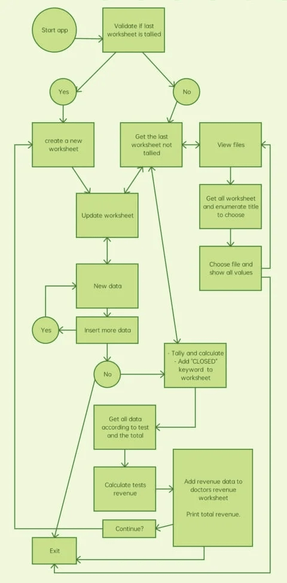

# Dr Heart Clinic - Portfolio 3
***
 
## Table of Contents:
* [What does it do and what does it need to fulfill?](#what-does-it-do-and-what-does-it-need-to-fulfill)
* [Functionality of Project](#functionality-of-project)
* [Wireframing](#wireframing)
* [Technology Used](#technology-used)
* [Database](#database)
* [Features](#features)
   * [Future Features](#future-features)
* [Testing](#testing)
   * [Defensive Design](#defensive-design)
* [Deployment](#deployment)
* [Credits](#credits)
   * [Special Thanks & Acknowledgements](#special-thanks--acknowledgements)
 
***
 
## Welcome to Dr. Heart Clinic!
 

[This is the deployed project](https://portfolio-3-dr-heart-clinic.herokuapp.com/)

[To access the dr-heart-clinic spreadsheet](https://docs.google.com/spreadsheets/d/1WnWbp-BpXRPl4qDXBxWytC5SYB3dAyzomdwumLzJAzE/edit?usp=sharing)
 
***
 
## What does it do and what does it need to fulfill?
The application is to help the "Dr. Heart Clinic" to control and get data of patient's tests and visualize monthly tests stadistics and tests revenue.
 
### Functionality of Project
This application contains function to gather data of each patient, save data into a google spreasheet, calculate total tests and their amount value and update the clinic's monthly revenue.
 
[Back to top](#table-of-contents)
 
## Chart
 
The flow chart

 
## Technology Used
 
#### Languages, Frameworks, Editors & Version Control:
 
* Techstack

   - Python 3
 
#### Tools Used:
 
* Google Drive
* Google Sheets

[Back to Top](#table-of-contents)

## Features
 
The project boasts several key features:
* Create: ...
 
[Back to Top](#table-of-contents)
 
#### Future Features:
 
* Detail future implementations here...
 
## Testing
 
Testing was ...
 
#### Found Bugs and Fixes:
 
During manual testing...
 
[Back to Top](#table-of-contents)
 
## Deployment
 
Detail deployment here...
 
[Back to Top](#table-of-contents)
 
## Credits
 
* Love Sandwich
* Geeks for geeks
* Stackoverflow
 
[Back to Top](#table-of-contents)
 
#### Special Thanks & Acknowledgements:
 
* Team 11 🤜
* To my mentor, who patiently guide me along my coding journey
* To my family, especially my daughter for encouraging me and inspiring me everyday.
* To my work and co-workers for inspiring me in making this project.
 
###### <i>Disclaimer: This project was created for educational use only as part of Code Institute's 2021 Christmas Hackathon</i>
 
[Back to Top](#table-of-contents)
