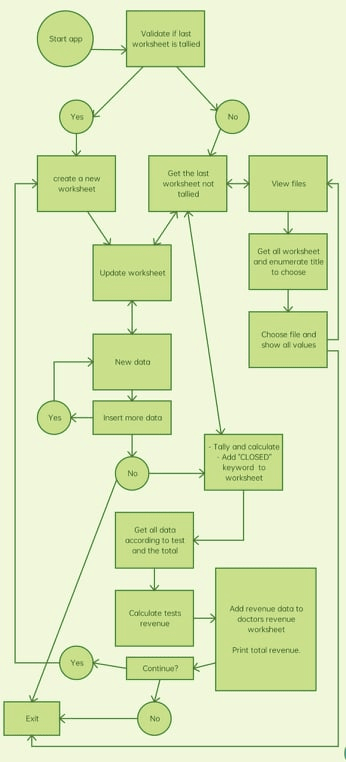
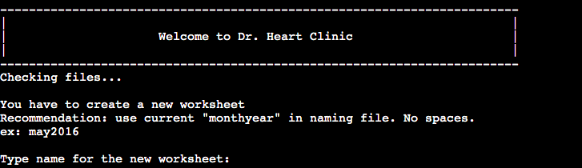

# Dr Heart Clinic - Portfolio 3
***
 
## Table of Contents:
* [What does it do and what does it need to fulfill?](#what-does-it-do-and-what-does-it-need-to-fulfill)
* [Functionality of Project](#functionality-of-project)
* [Wireframing](#wireframing)
* [Technology Used](#technology-used)
* [Database](#database)
* [Features](#features)
   * [Future Features](#future-features)
* [Testing](#testing)
   * [Defensive Design](#defensive-design)
* [Deployment](#deployment)
* [Credits](#credits)
   * [Special Thanks & Acknowledgements](#special-thanks--acknowledgements)
 
***
 
## Welcome to Dr. Heart Clinic!
 

[This is the deployed project](https://portfolio-3-dr-heart-clinic.herokuapp.com/)

[To access the dr-heart-clinic spreadsheet](https://docs.google.com/spreadsheets/d/1WnWbp-BpXRPl4qDXBxWytC5SYB3dAyzomdwumLzJAzE/edit?usp=sharing)
 
***
 
## What does it do and what does it need to fulfill?
The application is to help the "Dr. Heart Clinic" to control data of each patient's tests and visualize all monthly tests stadistics and revenue.
 
### Functionality of Project
This application contains functions:
 - to gather data of each patient
 - to save data into a google spreasheet
 - to calculate total tests
 - to calculate amount value of each tests and update the clinic's monthly revenue.
 
[Back to top](#table-of-contents)
 
## Chart
 
The flow chart

 
## Technology Used
 
#### Languages, Frameworks, Editors & Version Control:
 
* Tech stack used:

   - Python 3
 
#### Tools Used:
 
* Google Drive
* Google Sheets

[Back to Top](#table-of-contents)

## Features
 
The project boasts several key features:

* WELCOME MESSAGE AND CHECKING FILE TO UPDATE

Welcomes the user when the app is opened. It checks all files and get the last file for data update. The name of the file to be updated appears underneath so the user knows what file to update, which is, the current month.

* NEW WORKSHEET

If the app detects that there is no file to update when user opens the app (meaning last file is already calculated and tallied), it asks the user to create a new worksheet before starting to work.

* MAIN MENU

There are different options in the main menu of the app:

- Add data to update file
- Tally, calculate and update worksheets
- View worksheets data
- Exit

* ADD DATA

To enter new data to update current month worksheet:

      - data should be separated with comma, no spaces.
      - Patient name can have spaces.
      - Use only the tests keywords to update file

An example is shown to guide the user.

* TALLY, CALCULATE AND UPDATE WORKSHEET

When tally option is selected, a message is prompted to the user reminding that the worksheet will not be accessible for new data and a new worksheet will be created.

This feature includes:

      - Appending "CLOSED" text into the worksheet as a sign that the worksheet is tallied and closed
      - Gets all the patients tests and tally them
      -  Calculates the amount value of each tallied tests to get the revenue
      - Updates the worksheets to save all gathered data and the calculated revenue

* VIEW DATA FROM WORKSHEET

   * View patients

      To view all patients name and tests.

   * Test statistics
   
      To view all tests tally result.

   * Revenue File
   
      To view monthly revenue by test.

[Back to Top](#table-of-contents)
 
#### Future Features:
 
* For future features:

   * Search patient and view history of patient's test
   * Add date when updating patients data
   * Calculate total revenue of a specific range (6 months / yearly)
 
## Testing
 
[Pep8online](http://pep8online.com/) is used to check code for validation to make sure there are no errors of bugs.

Mnaual testing was done during the development of the application. The terminal is used for testing before pushing to branch to see there's no error in the code.

Tested all new data is saved to the worksheet, new worksheet is accessible when app is running. Tested all the calculations and update each worksheet.

Tested deployed app to make sure all functions are working well and no error or bugs.
 
#### Found Bugs and Fixes:
 
During manual testing...
 
[Back to Top](#table-of-contents)
 
## Deployment
 
Detail deployment here...
 
[Back to Top](#table-of-contents)
 
## Credits
 
* Love Sandwich
* Geeks for geeks
* Stackoverflow
 
[Back to Top](#table-of-contents)
 
#### Special Thanks & Acknowledgements:
 
* Team 11 🤜
* To my mentor, who patiently guided me along my coding journey.
* To my family, especially my husband and my daughter for encouraging me everyday.
* To my work and co-workers for inspiring me in making this project.
* To the tutors and the CI slack community.
 
###### <i>Disclaimer: This project was created for educational use only as part of the portfolio 3</i>
 
[Back to Top](#table-of-contents)
